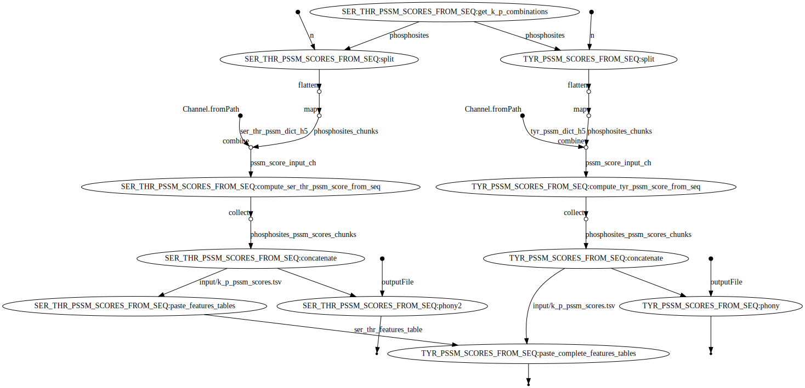

# SELPHI<sub>2.0</sub> PSSM features

Compute kinase-phosphosite PSSM scores to be used as features in the SELPHI<sub>2.0</sub> model.

> Research paper: [https://doi.org/10.1101/2022.01.15.476449](https://doi.org/10.1101/2022.01.15.476449)

## Build the container image

Requires [Docker](https://www.docker.com) and [Apptainer](https://apptainer.org).

```bash
docker build -t selphi_2_pssms - < env/Dockerfile
docker save -o env/selphi_2_pssms.tar.gz selphi_2_pssms
singularity build env/selphi_2_pssms.sif docker-archive://env/selphi_2_pssms.tar.gz
```

## Customise `nextflow.config`

Modify `process.executor`, `process.queue`, `workDir`, and `env.out_dir` according to the infrastructure where the workflow will be executed. Find the Nextflow [configuration file](https://www.nextflow.io/docs/latest/config.html) documentation.

Set `env.selphi_2_k_p_info` to the path of the input kinase-phosphosite pairs.

Finally set `params.n_jobs` to the preferred maximum number of cores that an individual process should use.

## PSSMs

This workflow generates PSSMs scores associated to kinase-substrate pairs in

```bash
${env.out_dir}/pssm_score/k_p_ser_thr_pssm_scores.tsv
${env.out_dir}/pssm_score/k_p_tyr_pssm_scores.tsv
```

All other features of kinase-substrate pairs are taken from

```bash
${env.selphi_2_features_table}
```

All features are merged together in

```bash
${env.out_dir}/features_table/k_p_features.tsv
```

## Run the workflow

```bash
nextflow run main.nf -c nextflow.config -resume -with-dag misc/flowchart.svg
```



## Misc

Optionally, linear classifiers of kinase-phosphosite interaction using uniquely the PSSM score predictor are built and evaluated computing ROC and PR curves a hundred times, each time using a different randomly sampled negative set of examples 10 times larger than the positive set. ROC and PR curves can be found in:

```bash
${env.out_dir}/pssm_model_100_rand_neg_sets/*.pdf
```

The same is done with the Phosphormer model:

```bash
${env.out_dir}/phosformer_model_100_rand_neg_sets/*.pdf
```
